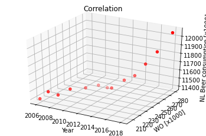

```python
import pandas as pd
data = pd.read_csv("istherecorrelation.csv", decimal=',', delimiter=";")
```


```python
print (data)
```

        Year  WO [x1000]  NL Beer consumption [x1000 hectoliter]
    0   2006       205.9                                   11402
    1   2007       208.6                                   11492
    2   2008       212.7                                   11450
    3   2009       220.5                                   11502
    4   2010       233.2                                   11474
    5   2011       242.4                                   11480
    6   2012       245.4                                   11452
    7   2013       241.4                                   11484
    8   2014       250.2                                   11555
    9   2015       255.7                                   11601
    10  2016       261.2                                   11731
    11  2017       267.9                                   11862
    12  2018       280.1                                   12048


```python
from mpl_toolkits.mplot3d import Axes3D
import matplotlib.pyplot as plt
```


```python
x= data["Year"]
y= data["WO [x1000]"]
z= data["NL Beer consumption [x1000 hectoliter]"]

plt.figure(figsize=(10, 10), dpi=300)
fig = plt.figure()
ax = fig.add_subplot(111, projection='3d')
ax.scatter(x, y, z, c='r', marker='o')
ax.set_title('Correlation')
ax.set_xlabel('Year')
ax.set_ylabel('WO [x1000] ')
ax.set_zlabel('NL Beer consumption [x1000]')

plt.show()
```


    <Figure size 3000x3000 with 0 Axes>





```python

```
